# AWS 기반 영수증 OCR 가계부 SaaS 프로젝트

FastAPI 기반 MSA 구조로 구현한 가계부 서비스입니다.  
사용자는 영수증 이미지를 업로드하면 OCR과 AI 분류를 통해 거래 내역을 자동으로 저장하고, 예산/대시보드/구독 기능까지 한 번에 사용할 수 있습니다.  
프로젝트 인프라와 배포 과정에서는 `EC2`, `VPC`, `API Gateway`, `ALB`, `S3`, `RDS`, `Textract`, `ECR`, `CodeCommit`, `CodePipeline`, `CodeBuild`, `IAM`, `CloudWatch`, `WAF`를 중심으로 AWS 환경 구성.

---

## 1) 주요 기능

- 영수증 이미지 업로드 후 `Textract` 기반 OCR 수행
- OCR 결과를 바탕으로 거래 내역 자동 생성
- 월별 예산 설정 및 소비 현황 확인
- 대시보드에서 월별/카테고리별 지출 분석
- JWT 기반 로그인/회원 관리
- Stripe 기반 구독 상태 연동
- S3 문서 저장소와 RDS 메타데이터 연계
- CloudWatch 기반 로그 수집 및 운영 모니터링

---

## 2) 프로젝트 한 줄 소개

이 프로젝트는 영수증 업로드부터 OCR, 거래 자동 기록, 예산 관리, 구독 결제까지 하나의 흐름으로 연결한 AWS 기반 가계부 SaaS  
프론트엔드, 인증 서비스, 가계부 서비스, OCR/AI 서비스를 분리한 MSA 구조 사용, AWS 네트워크/배포/보안/모니터링 설계 내용 기준으로 README 형식에 맞춰 정리

---

## 3) 기술 스택

- Frontend: HTML, CSS, JavaScript, Nginx
- Backend: FastAPI, SQLAlchemy, Pydantic
- Database: MySQL, Amazon RDS
- Storage: Amazon S3
- OCR: Amazon Textract, Tesseract fallback
- Infra: EC2, VPC, ALB, API Gateway, IAM, WAF
- CI/CD: GitHub Actions, Amazon ECR, CodeCommit, CodeBuild, CodePipeline
- Monitoring: CloudWatch
- External: Stripe

---

## 4) 저장소 분석 요약

현재 저장소는 다음과 같은 구조로 구성되어 있습니다.

| 구분 | 경로 | 설명 |
| --- | --- | --- |
| 프론트엔드 | `frontend/` | 로그인, 대시보드, 영수증 업로드, 구독/설정 화면 |
| 인증 서비스 | `services/auth-service/` | 회원가입, 로그인, JWT, Stripe 구독 관리 |
| 가계부 서비스 | `services/ledger-service/` | 거래/카테고리/예산/대시보드/영수증 처리 |
| OCR 서비스 | `services/ocr-ai-service/` | Textract OCR 및 영수증 분류 |
| 인프라 문서 | `구조 md/` | AWS 인프라, CI/CD, 보안, 운영 설계 문서 |
| 로컬 실행 | `docker-compose.yml` | 멀티 서비스 로컬 개발 실행 |

이 프로젝트는 단순 CRUD 수준이 아니라, 영수증 이미지 업로드 이후 `S3 -> Textract -> OCR/AI 분류 -> RDS 저장 -> 대시보드 집계`로 이어지는 실제 운영형 흐름 기준 설계.

---

## 5) 환경 구분

현재 저장소 기준으로는 `local` 개발 환경과 `GitHub Actions -> EC2` 배포 흐름이 먼저 구현되어 있고, `dev` / `stage` / `prod` 는 같은 서비스 구조를 유지한 채 환경별 변수와 배포 대상만 바꿔 운영하는 방식으로 정리하는 것이 가장 일관됩니다.

| Environment | Purpose | Runtime | DB | Entry Point | Deployment Basis |
| --- | --- | --- | --- | --- | --- |
| `local` | 개인 개발 / 디버깅 | Docker Compose | 로컬 DB 컨테이너 | `localhost` | `docker compose up -d --build` |
| `dev` | 팀 공유 개발 서버 | 경량 쿠버네티스 또는 단일 서버 | 개발용 DB | 내부 주소 또는 포트포워딩 | 환경별 매니페스트 / 변수 분리 |
| `stage` | QA / 리허설 | 운영과 유사한 배포 환경 | 스테이징 DB | 사설 URL 또는 임시 도메인 | 운영 전 검증용 배포 |
| `prod` | 실제 운영 | 운영 배포 환경 | 운영 DB | 운영 도메인 | 승인된 이미지 / 환경변수 기준 배포 |

### 5-1. Local

- 이 저장소에서 가장 직접적으로 재현 가능한 환경입니다.
- `docker-compose.yml` 기준으로 프론트엔드와 백엔드 서비스를 함께 올려 기능 확인, API 연결, OCR 흐름을 점검합니다.
- 새 기능 개발, UI 확인, API 디버깅은 우선 `local` 에서 끝내는 것을 기준으로 잡는 편이 안전합니다.

### 5-2. Dev

- `dev` 는 팀이 함께 보는 통합 개발 환경으로 두는 것이 적합합니다.
- 목적은 기능 완성 전 빠른 공유, 프론트엔드-백엔드 연동 확인, 외부 리소스 연계 테스트입니다.
- 이 단계에서는 운영 수준의 보안이나 고가용성보다 배포 속도와 로그 확인 편의성이 더 중요합니다.
- 현재 저장소에는 `k8s/overlays/dev` 같은 디렉터리가 없으므로, README 에서는 권장 운영 구조로 설명하는 것이 정확합니다.

### 5-3. Stage

- `stage` 는 운영 직전 검증 환경입니다.
- 애플리케이션 구조, 환경 변수, 이미지 태그, 외부 연동 설정을 `prod` 와 최대한 비슷하게 맞추고 최종 리허설을 수행합니다.
- 배포 자동화가 있다면 smoke test, 회귀 확인, 배포 순서 검증을 이 환경에서 먼저 수행하는 것이 좋습니다.
- 별도 매니페스트를 무조건 복제하기보다 공통 배포 정의를 재사용하고 환경별 값만 치환하는 방식이 유지보수에 유리합니다.

### 5-4. Prod

- `prod` 는 실제 사용자 트래픽을 받는 운영 환경입니다.
- 이미지 태그, 시크릿, 도메인, 스토리지, 데이터베이스 설정은 가장 엄격하게 관리해야 합니다.
- 배포는 수동 접속보다 CI/CD 에서 검증된 이미지와 승인된 변수 조합으로 수행하는 방식이 안정적입니다.
- 롤백 기준, 장애 대응 절차, 로그/모니터링 체계도 이 환경을 중심으로 문서화하는 것이 좋습니다.

### 5-5. Current Repository Status

- 현재 저장소에 실제 포함된 배포 관련 파일은 `docker-compose.yml` 과 `.github/workflows/deploy.yml` 입니다.
- 즉, 문서상으로는 `local` 과 `GitHub Actions` 기반 배포 흐름은 바로 설명할 수 있지만, `k8s/eks`, `k8s/overlays/dev`, `scripts/cicd/env/stage.sh`, `scripts/cicd/env/prod.sh` 는 아직 저장소에 존재하지 않습니다.
- 따라서 README 에는 `현재 구현됨` 과 `환경 확장 시 권장 구조` 를 구분해서 적는 편이 정확합니다.
- 추후 해당 디렉터리와 스크립트를 추가하면 `dev / stage / prod` 표를 실제 경로 기준으로 더 구체화할 수 있습니다.
---

## 6) 개발환경 구성과 AWS 구성 구분

### 6-1. 로컬 개발 환경

- `frontend`, `auth-service`, `ledger-service`, `ocr-ai-service`를 Docker Compose로 실행
- 서비스 간 내부 API 호출로 기능 검증
- 영수증 업로드 및 OCR 파이프라인 로컬 테스트

### 6-2. AWS 운영 환경

- `VPC` 내부에 퍼블릭/프라이빗 자원을 구분 배치
- 외부 트래픽은 `ALB`를 통해 백엔드 서비스로 전달
- 정적 파일 및 영수증 이미지는 `S3`에 저장
- 거래/문서/구독 메타데이터는 `RDS`에 저장
- 일부 외부 연동 및 확장 포인트는 `API Gateway` 기준으로 분리 설계
- OCR 처리는 `Textract` 사용
- 운영 배포 대상은 `EC2` 기반 컨테이너 런타임과 AWS 배포 파이프라인 기준으로 관리

### 6-3. 네트워크/보안 구성 포인트

- `IAM` 최소 권한 원칙 적용
- `WAF`로 외부 API 보호
- `ALB` 앞단에서 공개 트래픽 제어
- DB는 `RDS`로 분리하고 애플리케이션 계층과 네트워크 계층을 분리

---

## 7) Docker 실행

### 7-1. 실행

```bash
docker compose up -d --build
```

### 7-2. 접속

- `http://localhost`
- `http://localhost:8001/docs`
- `http://localhost:8002/docs`
- `http://localhost:8003/docs`

### 7-3. 종료

```bash
docker compose down
```

---

## 8) 서비스별 역할

### 8-1. auth-service

- 회원가입 / 로그인 / JWT 발급
- 사용자 정보 조회 및 수정
- Stripe 구독 상태 동기화

### 8-2. ledger-service

- 거래 CRUD
- 카테고리 및 예산 관리
- 영수증 업로드 처리
- 대시보드 통계 집계
- OCR 사용량 관리

### 8-3. ocr-ai-service

- S3에 저장된 영수증 이미지 조회
- `Textract` OCR 실행
- OCR 품질이 낮을 경우 Tesseract fallback
- 추출 텍스트 기반 거래 정보 분류

---

## 9) CI/CD 구성

이 프로젝트에서는 컨테이너 기반 배포 흐름을 AWS 서비스 중심으로 정리.

### 9-1. 배포 흐름

1. `CodeCommit`에 애플리케이션 소스 반영
2. `CodePipeline`이 변경 사항 감지
3. `CodeBuild`에서 이미지 빌드 및 테스트 수행
4. 빌드 결과 이미지를 `ECR`에 푸시
5. 운영 서버(`EC2`)에서 신규 이미지 배포

### 9-2. 핵심 포인트

- 서비스 이미지 버전 관리
- 배포 자동화 및 수동 작업 최소화
- 운영/검증 환경 분리
- 장애 시 이전 이미지 기준 롤백 가능하도록 구성
### 9-3. GitHub Actions Deployment

- `.github/workflows/deploy.yml` is triggered on every push to `main`
- `actions/checkout@v4` checks out the repository in the workflow runner
- `aws-actions/configure-aws-credentials@v4` configures AWS access from GitHub Secrets
- The workflow builds `services/ledger-service` and pushes the image to `Amazon ECR`
- `appleboy/ssh-action@v1.0.3` connects to the EC2 host, runs `git pull`, pulls the latest ECR image, and restarts containers with `docker-compose`
- Deployment secrets currently used: `ACCESS_KEY_ID`, `SECRET_ACCESS_KEY`, `EC2_SSH_KEY`
---

## 10) 운영 / 모니터링 / 보안

- `CloudWatch`로 애플리케이션 로그 및 운영 지표 수집
- API 오류율, OCR 실패율, 인프라 상태 모니터링
- `IAM` 정책으로 서비스별 권한 분리
- `WAF`를 통한 기본 웹 보안 정책 적용
- 업로드 파일은 `S3`에 저장하고 메타데이터는 `RDS`에 저장

---

## 11) AWS 콘솔 레퍼런스 이미지

### 11-1. VPC / Subnet 네트워크 구성 화면

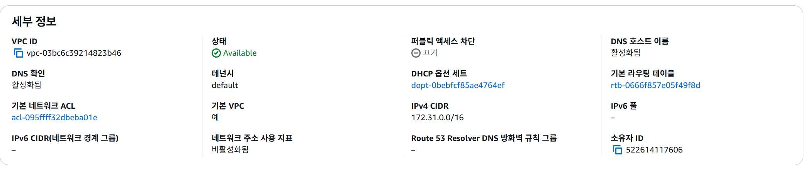
설명:  
- Amazon VPC 네트워크 인프라 구성 화면  
- VPC, Subnet, Route Table, Security Group 설정 확인  
- 서비스 전체 인프라가 동작하는 기본 네트워크 환경  

---

### 11-2. EC2 애플리케이션 서버 구성 화면

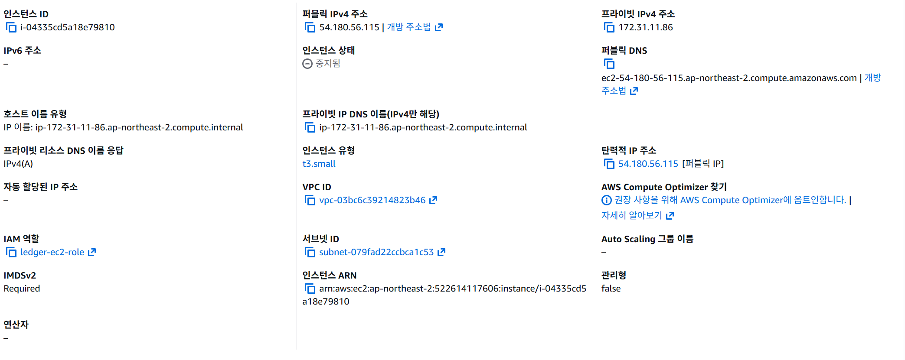
설명:  
- Amazon EC2 인스턴스 실행 상태 화면  
- Docker 기반 마이크로서비스(auth-service, ledger-service, ocr-ai-service) 운영 서버  
- 백엔드 애플리케이션 실행 환경  

---

### 11-3. ALB / Target Group / WAF 연결 화면

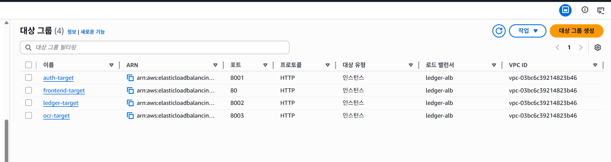 
설명:  
- Application Load Balancer 설정 화면  
- Target Group과 EC2 인스턴스 연결 상태 확인  
- AWS WAF 웹 방화벽을 통한 보안 보호 구성  

---

### 11-4. API Gateway 구성 화면

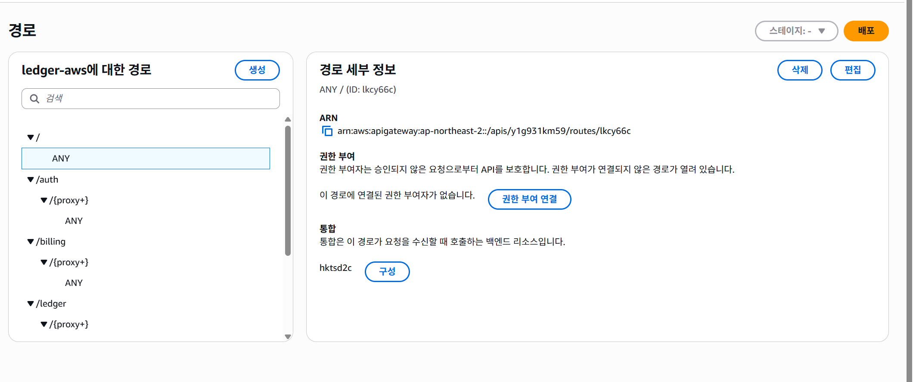

파일명: docs/images/aws-api-gateway.png  
설명:  
- Amazon API Gateway 설정 화면  
- 외부 클라이언트 요청을 처리하는 API 진입점 구성  
- 백엔드 서비스와 연결된 API 리소스 및 라우팅 확인  

---

### 11-5. S3 / Textract OCR 처리 화면

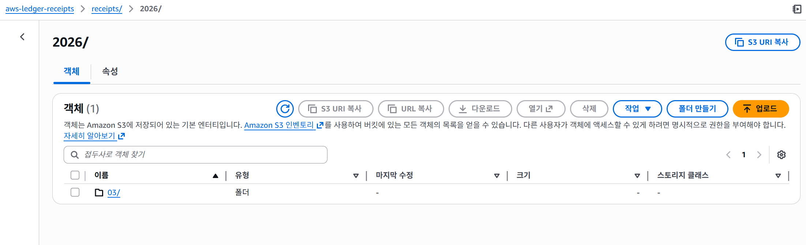  
설명:  
- Amazon S3 영수증 이미지 저장 버킷 화면  
- Amazon Textract를 활용한 영수증 텍스트 OCR 처리  
- 업로드된 이미지 기반 데이터 추출 흐름  

---

### 11-6. RDS 데이터베이스 운영 화면

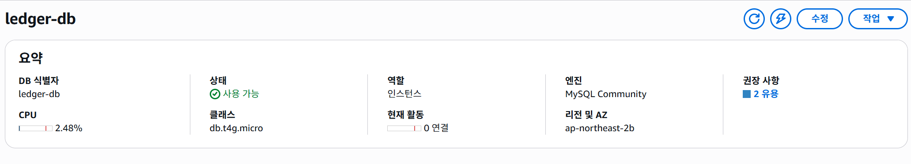
설명:  
- Amazon RDS MySQL 데이터베이스 인스턴스  
- 사용자 정보, 거래 내역, 영수증 데이터 저장  
- 애플리케이션 데이터 영속성 관리  

---

### 11-7. ECR 컨테이너 이미지 저장소 화면

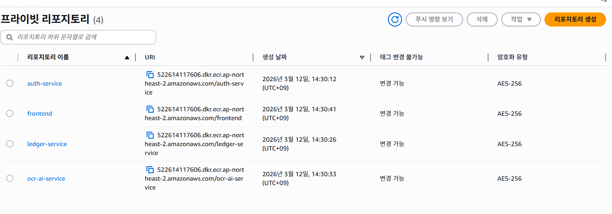
설명:  
- Amazon ECR 컨테이너 이미지 저장소  
- Docker 기반 애플리케이션 이미지 관리  
- CI/CD 파이프라인을 통한 이미지 배포  

---

### 11-8. CI/CD 파이프라인 화면 (GitHub Actions / CodePipeline)

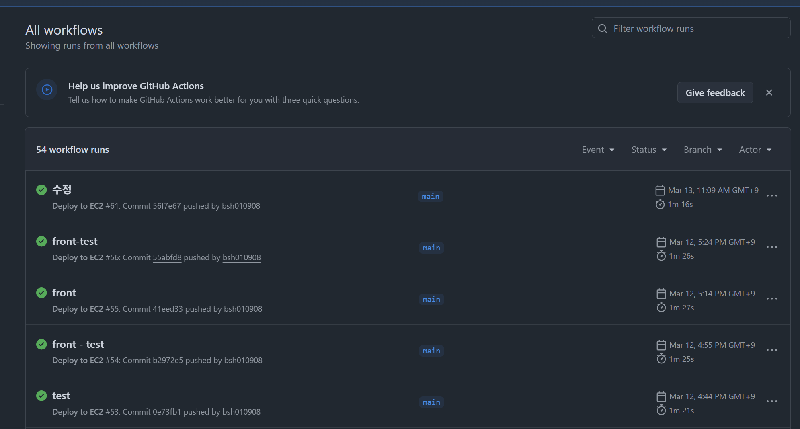
설명:  
- GitHub Actions 기반 자동 빌드 및 배포  
- AWS CodePipeline / CodeBuild 연동 CI/CD 파이프라인  
- 코드 변경 시 Docker 이미지 빌드 및 서비스 배포 자동화  

---

### 11-9. CloudWatch 모니터링 화면

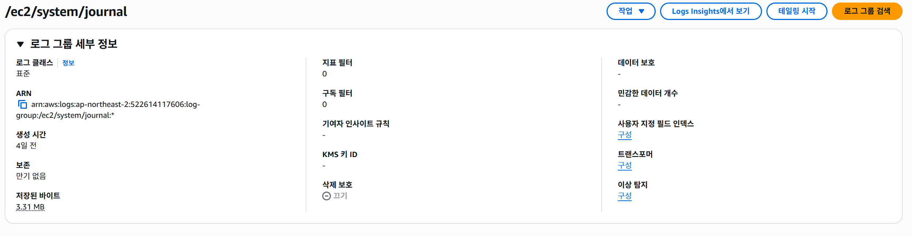 
설명:  
- Amazon CloudWatch 로그 및 모니터링 대시보드  
- EC2 및 애플리케이션 로그 수집  
- 시스템 상태 및 리소스 사용량 모니터링  

---

### 11-10. IAM 보안 및 권한 관리 화면

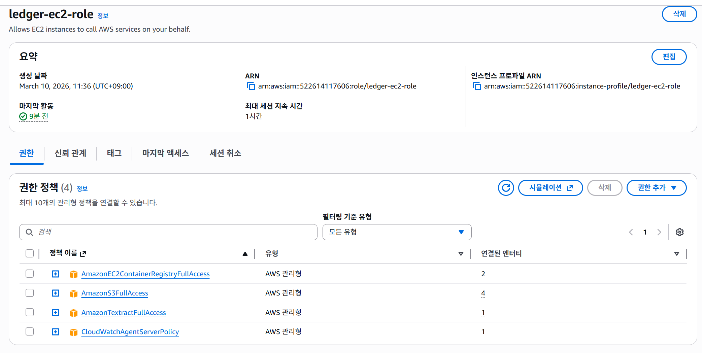
설명:  
- AWS IAM 사용자 및 권한 정책 관리  
- 서비스 간 접근 제어 및 보안 정책 설정  
- AWS 리소스 접근 권한 관리

## 12) Mermaid 다이어그램

### 12-1. 전체 서비스 흐름

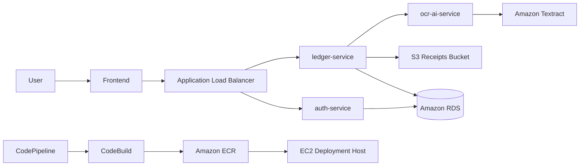

### 12-2. 영수증 OCR 처리 시퀀스

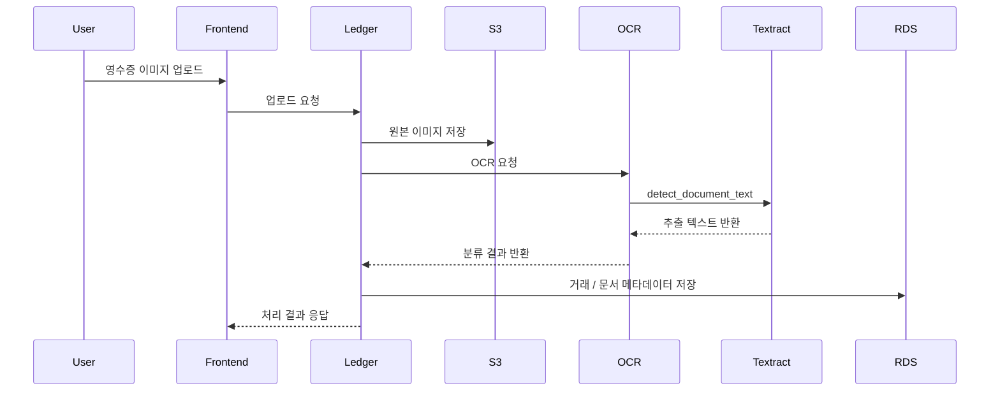

---

## 13) AWS 아키텍처 이미지 영역


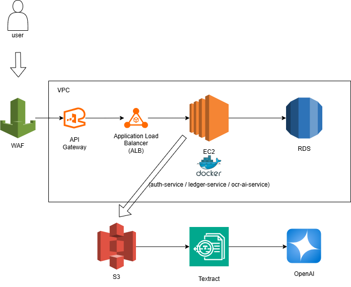


---

## 14) 화면 캡처

### 14-1. 메인 랜딩 페이지

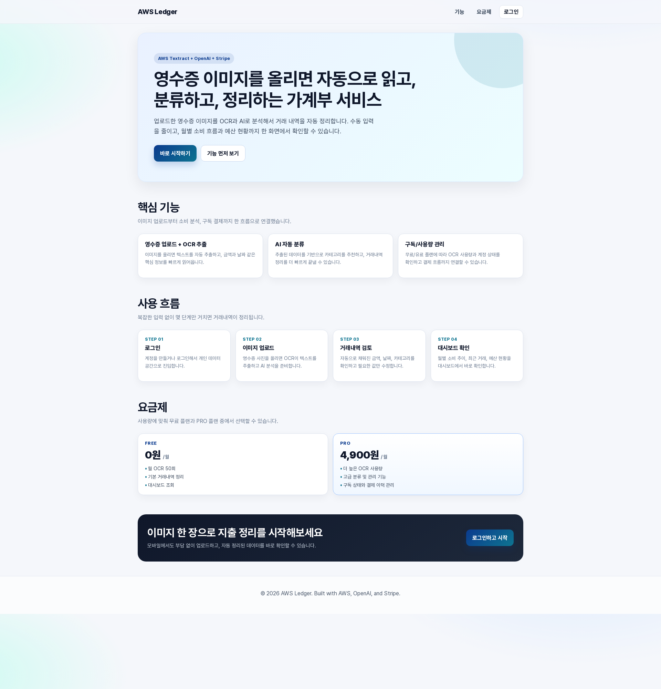

### 14-2. 로그인 / 회원가입 화면

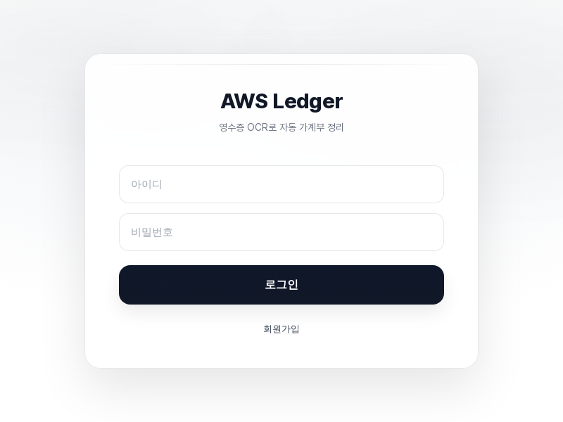

### 14-3. 영수증 업로드 화면

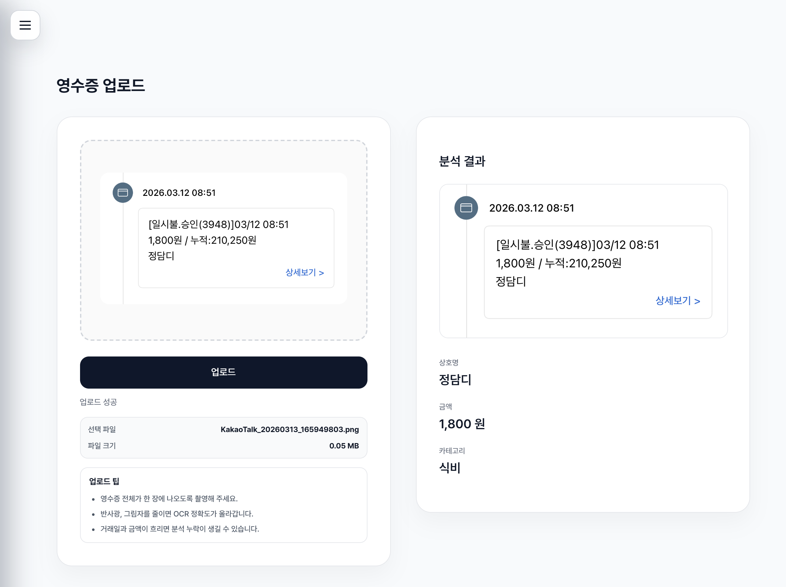

### 14-4. 대시보드 화면

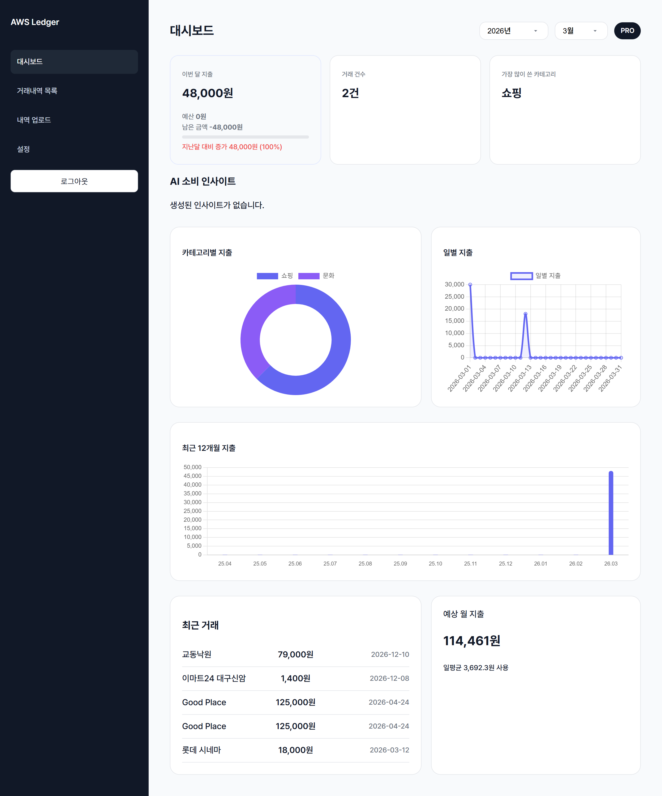

### 14-5. 구독 / 설정 화면

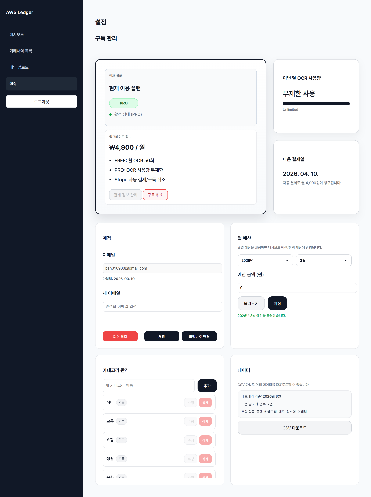

---

## 15) 주요 경로

- Frontend: `frontend/`
- Auth Service: `services/auth-service/`
- Ledger Service: `services/ledger-service/`
- OCR AI Service: `services/ocr-ai-service/`
- AWS 인프라 문서: `구조 md/AWS 인프라 설계서.md`
- 전체 구조 문서: `구조 md/전체 구조정리.md`
- 운영/모니터링 문서: `구조 md/운영-모니터링 설계서.md`
- 보안 문서: `구조 md/보안 설계서.md`


