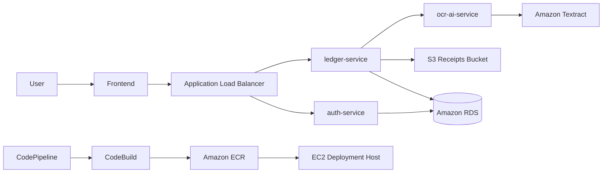
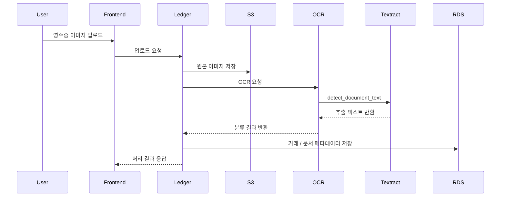

# AWS 기반 영수증 OCR 가계부 SaaS 프로젝트

FastAPI 기반 MSA 구조로 구현한 가계부 서비스입니다.  
사용자는 영수증 이미지를 업로드하면 OCR과 AI 분류를 통해 거래 내역을 자동으로 저장하고, 예산/대시보드/구독 기능까지 한 번에 사용할 수 있습니다.  
프로젝트 인프라와 배포 과정에서는 `EC2`, `VPC`, `API Gateway`, `ALB`, `S3`, `RDS`, `Textract`, `ECR`, `CodeCommit`, `CodePipeline`, `CodeBuild`, `IAM`, `CloudWatch`, `WAF`를 중심으로 AWS 환경 구성.

---

## 1) 주요 기능

- 영수증 이미지 업로드 후 `Textract` 기반 OCR 수행
- OCR 결과를 바탕으로 거래 내역 자동 생성
- 월별 예산 설정 및 소비 현황 확인
- 대시보드에서 월별/카테고리별 지출 분석
- JWT 기반 로그인/회원 관리
- Stripe 기반 구독 상태 연동
- S3 문서 저장소와 RDS 메타데이터 연계
- CloudWatch 기반 로그 수집 및 운영 모니터링

---

## 2) 프로젝트 한 줄 소개

이 프로젝트는 영수증 업로드부터 OCR, 거래 자동 기록, 예산 관리, 구독 결제까지 하나의 흐름으로 연결한 AWS 기반 가계부 SaaS입니다.  
프론트엔드, 인증 서비스, 가계부 서비스, OCR/AI 서비스를 분리한 MSA 구조 사용, AWS 네트워크/배포/보안/모니터링 설계 내용 기준으로 README 형식에 맞춰 정리.

---

## 3) 기술 스택

- Frontend: HTML, CSS, JavaScript, Nginx
- Backend: FastAPI, SQLAlchemy, Pydantic
- Database: MySQL, Amazon RDS
- Storage: Amazon S3
- OCR: Amazon Textract, Tesseract fallback
- Infra: EC2, VPC, ALB, API Gateway, IAM, WAF
- CI/CD: ECR, CodeCommit, CodeBuild, CodePipeline
- Monitoring: CloudWatch
- External: Stripe

---

## 4) 저장소 분석 요약

현재 저장소는 다음과 같은 구조로 구성되어 있습니다.

| 구분 | 경로 | 설명 |
| --- | --- | --- |
| 프론트엔드 | `frontend/` | 로그인, 대시보드, 영수증 업로드, 구독/설정 화면 |
| 인증 서비스 | `services/auth-service/` | 회원가입, 로그인, JWT, Stripe 구독 관리 |
| 가계부 서비스 | `services/ledger-service/` | 거래/카테고리/예산/대시보드/영수증 처리 |
| OCR 서비스 | `services/ocr-ai-service/` | Textract OCR 및 영수증 분류 |
| 인프라 문서 | `구조 md/` | AWS 인프라, CI/CD, 보안, 운영 설계 문서 |
| 로컬 실행 | `docker-compose.yml` | 멀티 서비스 로컬 개발 실행 |

이 프로젝트는 단순 CRUD 수준이 아니라, 영수증 이미지 업로드 이후 `S3 -> Textract -> OCR/AI 분류 -> RDS 저장 -> 대시보드 집계`로 이어지는 실제 운영형 흐름 기준 설계.

---

## 5) 환경 구분

| 환경 | 목적 | 구성 |
| --- | --- | --- |
| `local` | 개발 및 기능 확인 | Docker Compose 기반 멀티 서비스 실행 |
| `dev` | 통합 테스트 | AWS 리소스 연결 전/후 기능 검증 |
| `stage` | 배포 검증 | CodeBuild / CodePipeline 기반 사전 검증 |
| `prod` | 운영 | VPC, ALB, RDS, S3, WAF 포함 운영 환경 |

운영 환경에서는 인프라를 서비스 단위로 분리하고, 정적 자산/영수증 이미지/백엔드 API/DB/관측 계층을 분리해 관리하는 구조 사용.

---

## 6) 개발환경 구성과 AWS 구성 구분

### 6-1. 로컬 개발 환경

- `frontend`, `auth-service`, `ledger-service`, `ocr-ai-service`를 Docker Compose로 실행
- 서비스 간 내부 API 호출로 기능 검증
- 영수증 업로드 및 OCR 파이프라인 로컬 테스트

### 6-2. AWS 운영 환경

- `VPC` 내부에 퍼블릭/프라이빗 자원을 구분 배치
- 외부 트래픽은 `ALB`를 통해 백엔드 서비스로 전달
- 정적 파일 및 영수증 이미지는 `S3`에 저장
- 거래/문서/구독 메타데이터는 `RDS`에 저장
- 일부 외부 연동 및 확장 포인트는 `API Gateway` 기준으로 분리 설계
- OCR 처리는 `Textract` 사용
- 운영 배포 대상은 `EC2` 기반 컨테이너 런타임과 AWS 배포 파이프라인 기준으로 관리

### 6-3. 네트워크/보안 구성 포인트

- `IAM` 최소 권한 원칙 적용
- `WAF`로 외부 API 보호
- `ALB` 앞단에서 공개 트래픽 제어
- DB는 `RDS`로 분리하고 애플리케이션 계층과 네트워크 계층을 분리

---

## 7) Docker 실행

### 7-1. 실행

```bash
docker compose up -d --build
```

### 7-2. 접속

- `http://localhost`
- `http://localhost:8001/docs`
- `http://localhost:8002/docs`
- `http://localhost:8003/docs`

### 7-3. 종료

```bash
docker compose down
```

---

## 8) 서비스별 역할

### 8-1. auth-service

- 회원가입 / 로그인 / JWT 발급
- 사용자 정보 조회 및 수정
- Stripe 구독 상태 동기화

### 8-2. ledger-service

- 거래 CRUD
- 카테고리 및 예산 관리
- 영수증 업로드 처리
- 대시보드 통계 집계
- OCR 사용량 관리

### 8-3. ocr-ai-service

- S3에 저장된 영수증 이미지 조회
- `Textract` OCR 실행
- OCR 품질이 낮을 경우 Tesseract fallback
- 추출 텍스트 기반 거래 정보 분류

---

## 9) CI/CD 구성

이 프로젝트에서는 컨테이너 기반 배포 흐름을 AWS 서비스 중심으로 정리.

### 9-1. 배포 흐름

1. `CodeCommit`에 애플리케이션 소스 반영
2. `CodePipeline`이 변경 사항 감지
3. `CodeBuild`에서 이미지 빌드 및 테스트 수행
4. 빌드 결과 이미지를 `ECR`에 푸시
5. 운영 서버(`EC2`)에서 신규 이미지 배포

### 9-2. 핵심 포인트

- 서비스 이미지 버전 관리
- 배포 자동화 및 수동 작업 최소화
- 운영/검증 환경 분리
- 장애 시 이전 이미지 기준 롤백 가능하도록 구성

---

## 10) 운영 / 모니터링 / 보안

- `CloudWatch`로 애플리케이션 로그 및 운영 지표 수집
- API 오류율, OCR 실패율, 인프라 상태 모니터링
- `IAM` 정책으로 서비스별 권한 분리
- `WAF`를 통한 기본 웹 보안 정책 적용
- 업로드 파일은 `S3`에 저장하고 메타데이터는 `RDS`에 저장

---

## 11) AWS 콘솔 레퍼런스 이미지

### 11-1. VPC / 서브넷 구성 화면

```text
[이미지 삽입 위치]
- 추천 파일명: docs/images/aws-vpc-overview.png
- 설명: VPC, Subnet, Route Table, Security Group 구성 화면
```

### 11-2. ALB / Target Group / WAF 연결 화면

```text
[이미지 삽입 위치]
- 추천 파일명: docs/images/aws-alb-waf.png
- 설명: ALB 리스너 규칙, Target Group, WAF 연결 화면
```

### 11-3. API Gateway 화면

```text
[이미지 삽입 위치]
- 추천 파일명: docs/images/aws-api-gateway.png
- 설명: 외부 API 진입점 또는 연동 API 리소스 구성 화면
```

### 11-4. S3 / Textract / RDS 관련 화면

```text
[이미지 삽입 위치]
- 추천 파일명: docs/images/aws-s3-textract-rds.png
- 설명: 영수증 저장 버킷, OCR 처리, DB 운영 화면
```

### 11-5. ECR / CodePipeline / CodeBuild 화면

```text
[이미지 삽입 위치]
- 추천 파일명: docs/images/aws-cicd.png
- 설명: 빌드/배포 파이프라인과 컨테이너 이미지 저장소 화면
```

### 11-6. CloudWatch / IAM 모니터링 화면

```text
[이미지 삽입 위치]
- 추천 파일명: docs/images/aws-monitoring-security.png
- 설명: 로그 그룹, 대시보드, 권한 정책 확인 화면
```

---

## 12) Mermaid 다이어그램

### 12-1. 전체 서비스 흐름



### 12-2. 영수증 OCR 처리 시퀀스



---

## 13) AWS 아키텍처 이미지 영역

```text
[대표 아키텍처 이미지 삽입 위치]
- 추천 파일명: docs/images/aws-architecture-final.png
- 설명: EC2 / VPC / API Gateway / ALB / S3 / RDS / Textract / ECR / CodePipeline / CloudWatch / WAF를 한 장으로 정리한 최종 아키텍처
```

예시 마크다운:

```md

```

---

## 14) 화면 캡처

### 14-1. 메인 랜딩 페이지

```text
[이미지 삽입 위치]
- 추천 파일명: docs/images/screen-landing.png
```

### 14-2. 로그인 / 회원가입 화면

```text
[이미지 삽입 위치]
- 추천 파일명: docs/images/screen-auth.png
```

### 14-3. 영수증 업로드 화면

```text
[이미지 삽입 위치]
- 추천 파일명: docs/images/screen-upload.png
```

### 14-4. 대시보드 화면

```text
[이미지 삽입 위치]
- 추천 파일명: docs/images/screen-dashboard.png
```

### 14-5. 구독 / 설정 화면

```text
[이미지 삽입 위치]
- 추천 파일명: docs/images/screen-subscription.png
```

---

## 15) 주요 경로

- Frontend: `frontend/`
- Auth Service: `services/auth-service/`
- Ledger Service: `services/ledger-service/`
- OCR AI Service: `services/ocr-ai-service/`
- AWS 인프라 문서: `구조 md/AWS 인프라 설계서.md`
- 전체 구조 문서: `구조 md/전체 구조정리.md`
- 운영/모니터링 문서: `구조 md/운영-모니터링 설계서.md`
- 보안 문서: `구조 md/보안 설계서.md`
