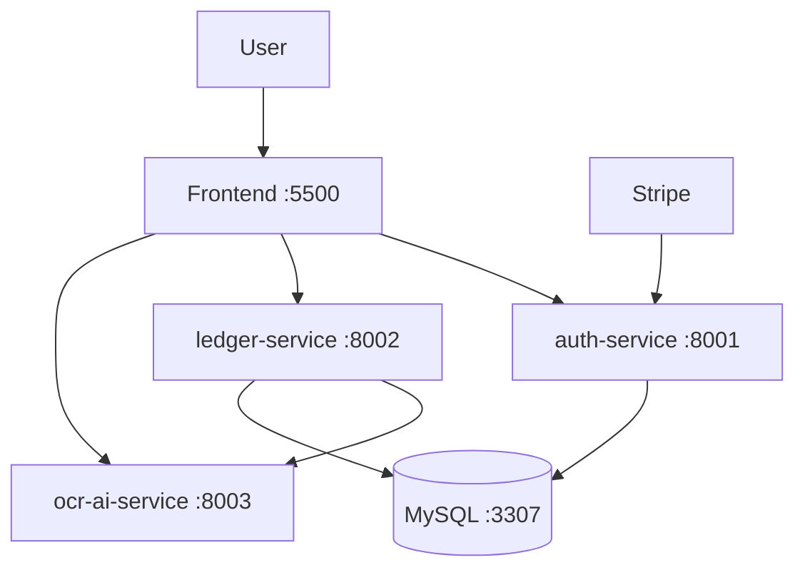
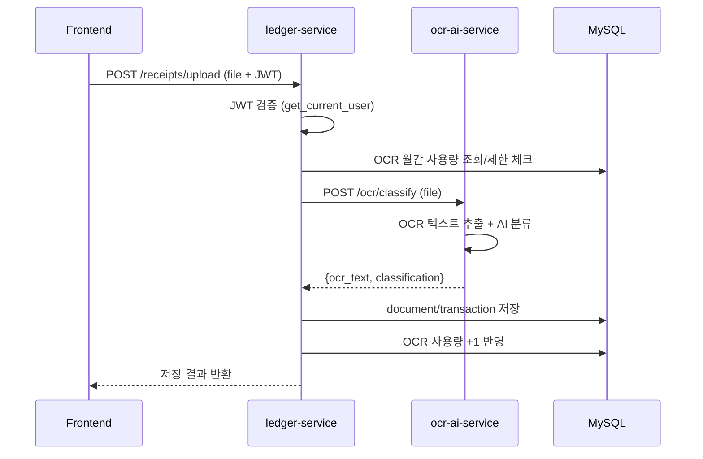
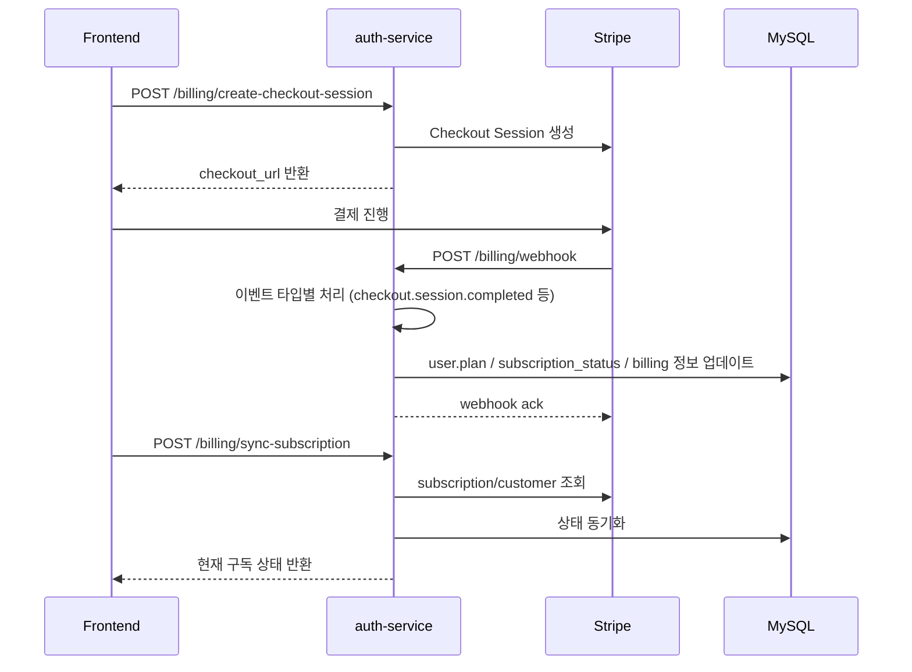

# 시스템 아키텍처 상세 흐름도

현재 코드(`docker-compose.yml`, 각 서비스 `main.py`/`routers`) 기준으로 정리한 상세 구조입니다.

## 1) 전체 시스템 구조

## 2) 영수증 OCR 처리 시퀀스
`ledger-service/app/routers/receipt_router.py` 기준.

## 3) 결제/구독 처리 시퀀스 (Stripe)
`auth-service/app/routers/billing_router.py` 기준.

## 4) 서비스별 주요 라우터

### auth-service (`:8001`)
- `POST /signup`
- `POST /login`
- `GET /me`
- `PUT /me/email`
- `PUT /me/password`
- `DELETE /me`
- `POST /billing/create-checkout-session`
- `POST /billing/sync-subscription`
- `POST /billing/cancel-subscription`
- `POST /billing/webhook`

### ledger-service (`:8002`)
- `POST /transactions`, `GET /transactions`, `PUT/DELETE /transactions/{tx_id}`
- `GET /transactions/recent`, `GET /transactions/export/csv`
- `POST /receipts/upload`
- `POST /budget`, `GET /budget`
- `GET /dashboard/overview` 외 대시보드 집계 API
- `GET/POST/PUT/DELETE /categories`
- `GET /ocr/usage`

### ocr-ai-service (`:8003`)
- `POST /ocr/classify`

## 5) 데이터 저장 책임
- `auth-service`: 사용자 계정, 로그인, 구독 상태(`plan`, `subscription_status`, `stripe_*`) 관리
- `ledger-service`: 거래, 카테고리, 예산, 문서, OCR 사용량 관리
- `ocr-ai-service`: 상태 저장 최소화(분류 처리 중심), 결과는 주로 `ledger-service`가 저장

## 6) 운영 포인트
- 모든 서비스는 startup 시 DB 준비 대기 후 테이블 생성 로직 포함(auth/ledger).
- CORS 허용 origin은 로컬 프론트(`localhost:5500`) 기준으로 설정됨.
- 내부 서비스 호출은 Docker 네트워크 DNS 이름 사용:
  - `ledger-service -> http://ocr-ai-service:8000/ocr/classify`
